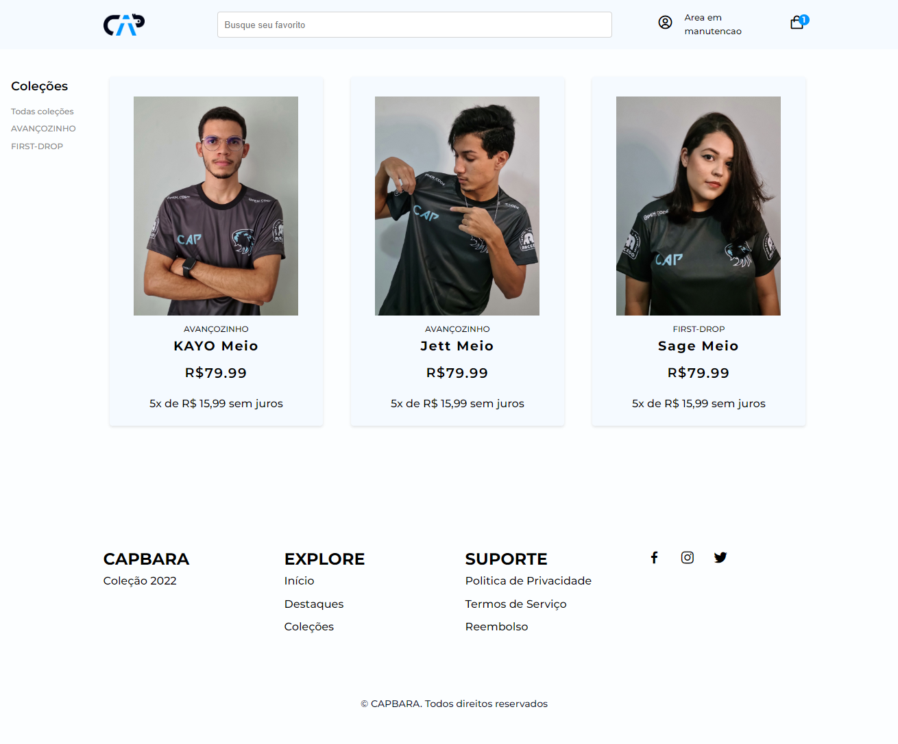

# CAPcommerce



> Um projeto de e-commerce utilizando JavaScript, HTML e CSS. O projeto utiliza o SimpleCart.js para a criação do carrinho de compras e pagamentos.

### Ajustes e melhorias

O projeto ainda está em desenvolvimento e as próximas atualizações serão voltadas nas seguintes tarefas:

- [x] Desenvolvimento de layout e estrutura
- [x] Aplicação do SimpleCart.js
- [x] Edição da estrutura do SimpleCart.js para atender as necessidades do projeto
- [x] Alteração do layout do dos produtos, exibição de imagens e descrição
- [x] Alteração do layout do carrinho de compras
- [ ] Calculo de frete com base no CEP do cliente (80% concluído)
- [ ] Área de login para clientes acompanharem seus pedidos (10% concluído)

## 🚀 Instalando CAPcommerce

Para instalar o CAPcommerce, siga estas etapas:

Windows:
```
git clone https://github.com/iaZe/CAPcommerce
```

## 🤝 Colaboradores

Agradecemos às seguintes pessoas que contribuíram para este projeto:

<table>
  <tr>
    <td align="center">
      <a href="https://github.com/iaZe">
        <sub>
          <b>Daniel Tavares</b>
        </sub>
      </a>
    </td>
    <td align="center">
      <a href="https://github.com/jallesbatista">
        <sub>
          <b>Jalles Batista</b>
        </sub>
      </a>
    </td>
  </tr>
</table>

## 📝 Licença

Esse projeto está sob licença. Veja o arquivo [LICENÇA](LICENSE.md) para mais detalhes.

[⬆ Voltar ao topo](#CAPcommerce)<br>
